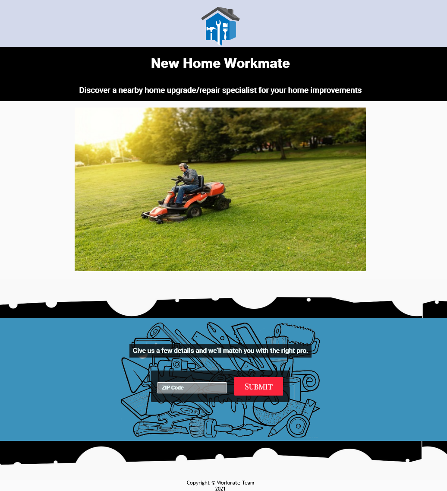
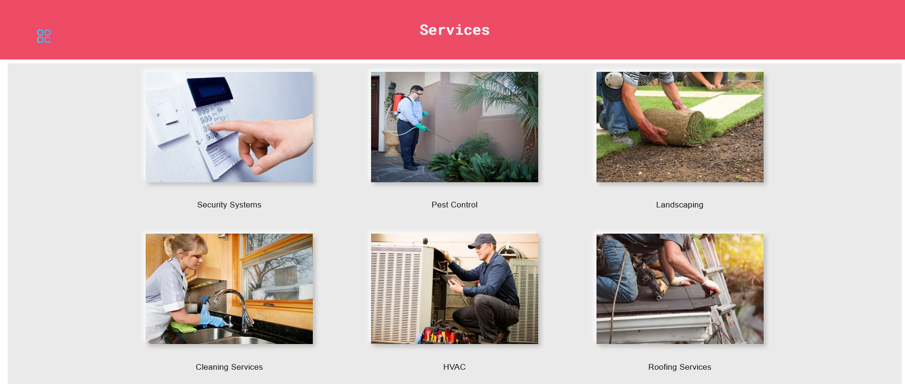

# New Home Workmate
Help new home buyers by providing information about nearby services available including

1. Security Systems
2. Pest Control
3. Landscaping
4. Cleaning Services
5. HVAC
6. Roofing Services
7. Plumbing
8. Electrical Services
9. Window Installation
10. Fencing Services
11. Garage Services
12. Siding Services
13. Solar Panel Installation
14. Carpet Cleaning
15. Shades & Blinds
16. Carpet Installation
17. Painting Services
18. Fireplace Services
19. Air Duct Services
20. Pool Services
21. Handyman

# Web Link
https://neshdev999.github.io/newHomeWorkMate/. 

# Screenshots
Landing Page/Home Page:

Services Page:

Businesses List Page:

Business Information Page/ Connect to Business Page:

# Summary

When app user enters zip code of his/her home address, he would able to see nearby businesses/services available with maps,contact and other detailed information about a business/service.

# Technology Used

### Front-End
* HTML5
* CSS/CSS3
* JQUERY
* JAVASCRIPT

